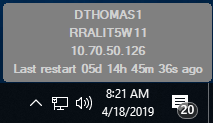

# System-Information
Desktop GUI that shows basic system information

GUI design based off of example script by "just me" from this thread: https://autohotkey.com/board/topic/90723-achieve-rainmeter-style-gui-via-gdip-library/
